# Playroom Diet

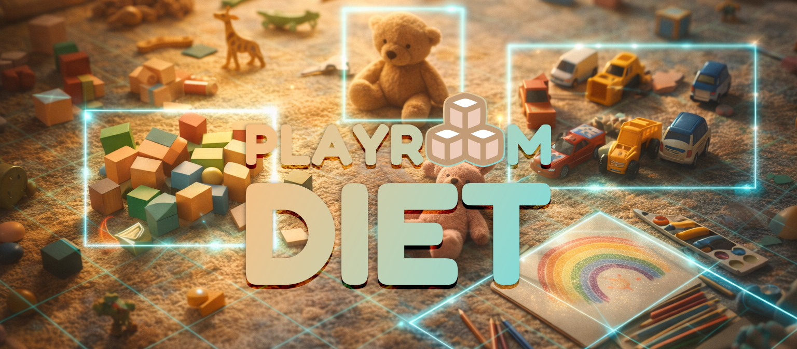

> Multi-agent AI with Apache Airflow and Gemini meets child development. Just like a diet needs balance, so does play. With Gemini 3, O*NET data, and an intuitive UI, you get a personalized roadmap, because parenting is hard enough.

**Playroom Diet** is an AI-powered child development tool that transforms chaotic toy piles into science-backed growth plans. Upload a photo of your playroom, and a multi-agent AI system analyzes the toys, maps them to professional skill frameworks, and creates a personalized six-month development roadmap. It also delivers play quests that encourage creative use of the toys you already own. Think of it as a nutritionist for your child’s play, ensuring a balanced diet of developmental stimulation.

> Next time your kids make a mess in their playroom, don't ask them to clean up right away. Take a photo and use that data.

**Try it yourself**: [playroom-diet.web.app](https://playroom-diet.web.app/)

> [!NOTE]
> _Keep in mind: this is a hackathon prototype. Daily limits apply to control costs._

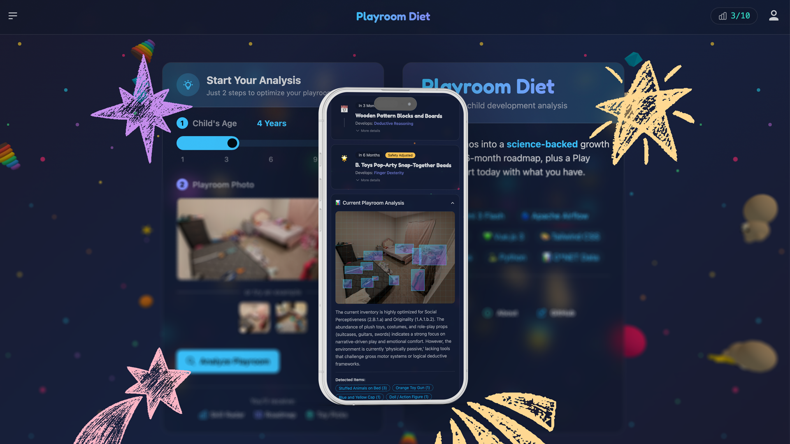

---

## tl;dr

This project demonstrates a **multi-agent AI pipeline** using Gemini 3 and Apache Airflow:

1. **Agent 1**: Vision agent extracts toy inventory with bounding box coordinates for visualization.
2. **Agent 2**: Maps toys to the [O*NET professional skills framework](https://www.onetonline.org/find/descriptor/browse/1.A) to identify which cognitive and physical abilities the toys develop and which require further development. Create recommendations of toys to add. Also uses a custom tool function to access an O*NET abilities and occupations database to inform parents about which abilities are important for specific careers.
3. **Agent 3**: Safety-checks recommendations against CPSC guidelines and generates search queries to find the suggested toys on platforms like Amazon. Uses a tool function to retrieve up-to-date product data.
4. **Agent 4**: Generates a Play Quest using existing toys to learn and enjoy until new toys arrive.

🧸 **The result:** Open Playroom Diet on any device, snap a photo of the chaos, and instantly get a science-backed development roadmap, verified shopping links, and a creative _Play Quest_ you can start right now with the toys you already have.

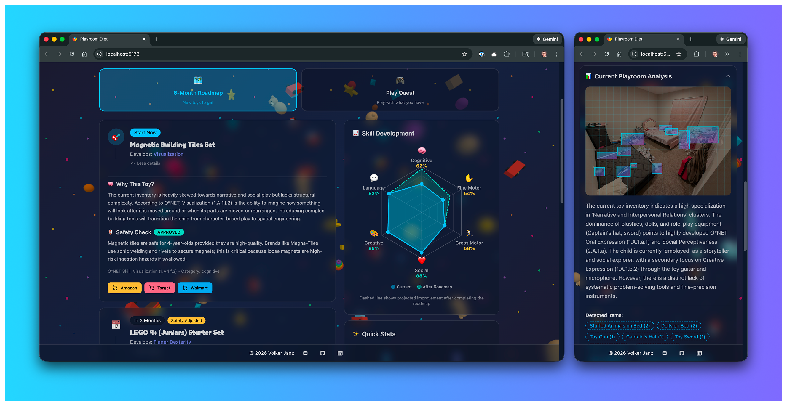

---

## Potential impact

Here is a draft for the **Potential Impact** section, written to match the tone and style of your existing README.

I have broken it down into a few key pillars to make it readable and compelling.

***

## Potential impact

**Parenting is arguably the most important job in the world, yet it is one of the few fields that has remained largely untouched by advanced AI.**

As a parent of two, I realized that we often manage our health, finances, and work with sophisticated AI tools, but we manage our children's development with guesswork and by succumbing to toy marketing. **Playroom Diet** addresses this gap by shifting the paradigm from *consuming toys* to *curating development*.

This can have a real impact on parenting:

- Democratizing child development expertise
- Reducing parental mental load
- Promoting sustainable and intentional play
- Promoting AI for parenting

---

## Inspiration

Every parent has been there: a room overflowing with toys. At the same time, during nearly every grocery trip, the kids notice new toys they want to add to their playroom. We keep adding toys without really considering a healthy mix that supports cognitive development.

> 👦👧 Having two kids myself, I've been there, many times.

**The problem isn't too few toys, it's the wrong mix.**

Just like a diet needs balance across food groups, a child's play environment needs balance across developmental domains. But most parents aren't child development experts, and the toy industry's marketing doesn't help.

**Playroom Diet bridges this gap** by treating play as a child's _job_ and mapping toy interactions to the same professional skill frameworks used by the US Department of Labor (O*NET). The result? Parents get clear, actionable insights instead of vague advice.

**Imagine a world where every playroom is optimized not for quantity, but for developmental quality.**

Next time your kids make a mess in their playroom, don't ask them to clean up right away. Take a photo and use that data.

---

## What it does

Simply upload a photo of your playroom, enter your child's age, and Playroom Diet delivers:

### 1. Toy inventory with visual heatmap

Gemini vision analyzes the image and identifies every toy, categorizing them by type and play mode. Each toy is mapped with bounding box coordinates for visual feedback. The result shows an image with detected toy clusters.

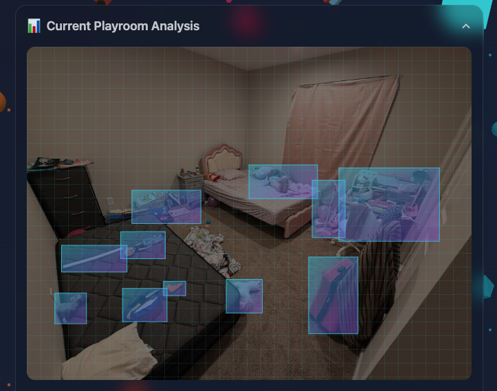

### 2. Ability assessment based on the O*NET framework

The US Department of Labor's [O*NET database](https://www.onetonline.org/find/descriptor/browse/1.A) defines the cognitive and physical abilities that predict success across 1,000+ occupations, from surgeons to software engineers. These are measurable capacities like *Visualization*, *Finger Dexterity*, and *Oral Expression* that form the foundation of career readiness.

**These abilities don't suddenly appear in adulthood. They're built through play.** A child stacking blocks is training *Visualization*. Finger painting develops *Fine Motor Control*. Pretend play builds *Social Perceptiveness*.

Playroom Diet maps your toys to these O*NET abilities, scoring your playroom across 6 developmental categories:

- **Cognitive**: Problem solving, reasoning, memory.
- **Fine motor**: Finger dexterity, precision, hand-eye coordination.
- **Gross motor**: Body coordination, balance, strength.
- **Social-emotional**: Empathy, cooperation, emotional expression.
- **Creative**: Imagination, artistic expression, open-ended play.
- **Language**: Communication, vocabulary, storytelling.

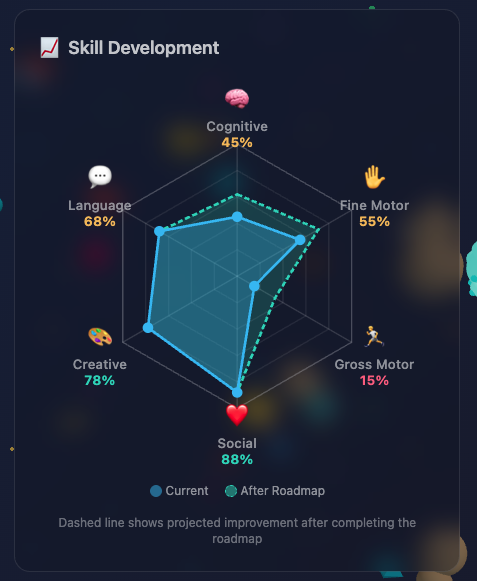

### 3. Personalized 6-month roadmap

Based on skill gaps, Playroom Diet generates a prioritized development plan:

- **Now**: Most critical gap to address immediately.
- **3 months**: Second priority for near-term growth.
- **6 months**: Third priority for longer-term development.

For each of the 3 steps, it generates a recommendation on which toy to buy, including the specific O*NET ability being developed and scientific reasoning. It also includes links to matching products on Amazon, Target, and Walmart, for one-click shopping along with a clear explanation of how the toy supports the child’s ability development. It also gives parents an idea of which occupations these abilities may be valuable for.

### 4. Safety verification based on CPSC guidelines

Every toy recommendation passes through a safety audit against Consumer Product Safety Commission (CPSC) guidelines for the child's age. Unsafe recommendations are automatically substituted with safer alternatives.

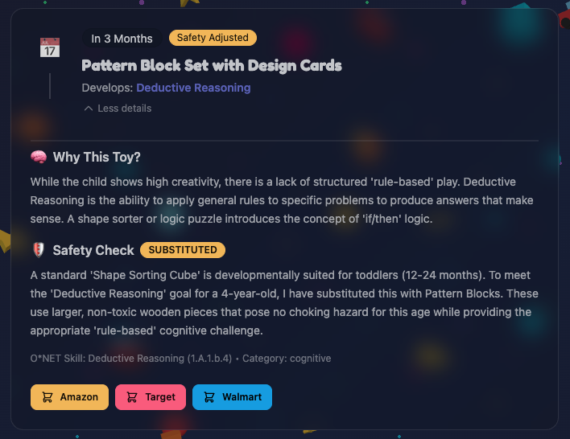

### 5. Play quest

Don't wait for new toys to arrive. A dedicated AI agent creates a fun, structured play activity using toys you already own. Each quest targets a specific O*NET skill, includes step-by-step instructions, and gives parents tips to maximize engagement, to start improving development today.

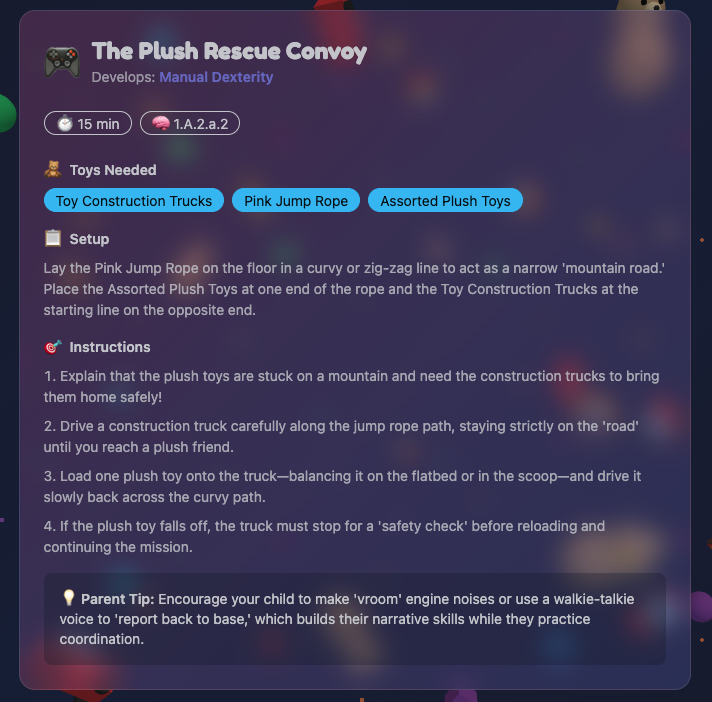

---

## How it was built

> [!NOTE]
> **Terminology:** The analysis of a playroom is called a `scan` throughout the project. A `scan` can have multiple `states` which are explained later.

### Tech stack

#### Backend

- Python 3.12 + [uv](https://github.com/astral-sh/uv)
- [FastAPI + Uvicorn](https://fastapi.tiangolo.com/)
- [Supabase](https://supabase.com/) (Postgres + Storage)
- [APScheduler](https://github.com/agronholm/apscheduler) (periodic background cleanup)
- [Pydantic](https://docs.pydantic.dev/latest/) (data validation)

#### Frontend

- [Vue.js 3](https://vuejs.org/) (Composition API)
- [Vite](https://vite.dev/)
- [Tailwind CSS](https://tailwindcss.com/) + [daisyUI 5](https://daisyui.com/)
- [Vue Router 4](https://router.vuejs.org/)
- [Vue Flow](https://vueflow.dev/) (system visualization)
- [Three.js](https://threejs.org/) (3D background)
- [canvas-confetti](https://github.com/catdad/canvas-confetti) (🎉)

#### Airflow (AI pipeline orchestration)

- [Apache Airflow 3.1](https://airflow.apache.org/)
- [Airflow AI SDK](https://github.com/astronomer/airflow-ai-sdk)
- [Pydantic AI](https://ai.pydantic.dev/)
- [Gemini API with Gemini 3](https://ai.google.dev/gemini-api/docs)
- [O*NET abilities and occupations database](https://www.onetcenter.org/database.html) (data source)

#### Infrastructure

- **Backend**: [Google Cloud Run](https://cloud.google.com/run)
- **Frontend**: [Firebase Hosting](https://firebase.google.com/)
- **Airflow**: [Astronomer Astro](https://www.astronomer.io/product/)
- **Database**: [Supabase](https://supabase.com/)
- **Storage**: [Supabase](https://supabase.com/)

> All components are implemented in a platform-independent manner. For example, the database can be any PostgreSQL instance, and Airflow can run on any hosting provider, as only open-source features are used. This approach maximizes flexibility, and platforms are chosen solely for cost optimization.

### System Architecture

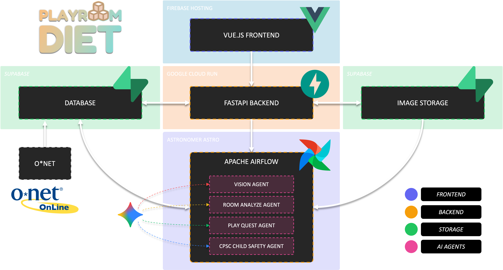

### The multi-agent pipeline

The heart of Playroom Diet is the **orchestrated multi-agent architecture** with Gemini and Apache Airflow.

#### Airflow pipeline

The Airflow project contains one Dag (`process_scans`), which orchestrates 4 AI agents that transform a playroom photo into a personalized child development plan. Each agent has a focused task with structured Pydantic outputs.

The Dag has no `schedule` and is meant to be triggered via the Airflow REST API by the Playroom Diet backend every time a playroom picture is uploaded.

Once started, it will claim pending scans from the underlying Postgres `scans` table using atomic locking. All agent tasks use dynamic task mapping to process scans in parallel, with runtime generated tasks (one per scan). To ensure system stability, the parallelism per task is limited via `max_active_tis_per_dag` and the overall Dag parallelism is limited via `max_active_runs`.

#### Race condition handling

The Dag uses **atomic scan claiming** via `UPDATE ... FOR UPDATE SKIP LOCKED` to prevent race conditions:

1. When `get_new_scans` runs, it atomically claims open scans by setting their status from `processing` to `in_flight` in one atomic operation.
2. The `FOR UPDATE SKIP LOCKED` clause ensures concurrent Dag runs claim different scans.
3. Multiple Dag runs can process in parallel, each working on its own set of scans.
4. This eliminates wait times in case a user submits a playroom picture while the Dag is running.

#### Status flow

Each scan is moving through 3 distinct states. The backend creates each scan with the `processing` status, while the Airflow pipeline updates the status accordingly.

**Status flow**: `processing` (new) -> `in_flight` (claimed) -> `done` (complete).


#### AI agents

The [Airflow AI SDK](https://github.com/astronomer/airflow-ai-sdk) is an open-source Python library, that facilitates the integration and orchestration of LLMs and AI agents directly within Apache Airflow pipelines. It provides decorator-based tasks to seamlessly incorporate AI functionality into traditional data and machine learning workflows. It is based on [PydanticAI](https://ai.pydantic.dev/) so that many of the features can be used.

The model used for all agents is `gemini-3-flash-preview`.

For Playroom Diet, all agents are defined with a model, a strict Pydantic output type, a system prompt based on the role in the multi-agent system, and some are provided with tool functions.

**Example:**

```python
@task.agent(
    agent=Agent(
        model="gemini-3-flash-preview",
        output_type=AnalysisResult,
        system_prompt="...",
        tools=[get_careers_for_skill]
    )
)
```

🤖 **Agent 1:** _Vision Agent_ `analyze_image`

- **Model**: Gemini 3 Flash (vision)
- **Input**: Playroom photo from the image storage
- **Output**: `ToyInventory` with bounding boxes
- **Purpose**: Extract every visible toy with normalized coordinates (0-1 range)

🤖 **Agent 2:** _Room Analyze Agent_ `analyze_playroom`

- **Model**: Gemini 3 Flash
- **Input**: Toy inventory + child's age
- **Tools**: `get_careers_for_skill` (database lookup)
- **Output**: `AnalysisResult` with skill scores and 3-item roadmap
- **Purpose**: Map toys to O*NET abilities, score 6 development categories, identify gaps, and forecast future careers.

**Career forecasting**
This agent uses a custom tool to query the O*NET database. It connects identified toy-based skills (like "Manual Dexterity") to high-value future careers.
> *"While magnetic tiles develop basic spatial awareness... High levels of Manual Dexterity are critical for careers like Oral and Maxillofacial Surgeons and General Dentists."*

🤖 **Agent 3:** _CPSC Child Safety Agent_ `safety_check`

- **Model**: Gemini 3 Flash
- **Input**: Development roadmap + child's age
- **Tools**: `duckduckgo_search_tool` (to search current data about products)
- **Output**: `ToyRecommendation` with safety decisions
- **Purpose**: Validate against CPSC guidelines, substitute unsafe toys, generate shopping queries

🤖 **Agent 4:** _Play Quest Agent_ `generate_play_quest`

- **Model**: Gemini 3 Flash
- **Input**: Toy inventory + child's age
- **Output**: `PlayQuest` activity details
- **Purpose**: Create an immediate play activity using existing toys
- **Note**: Runs in parallel with Agent 2

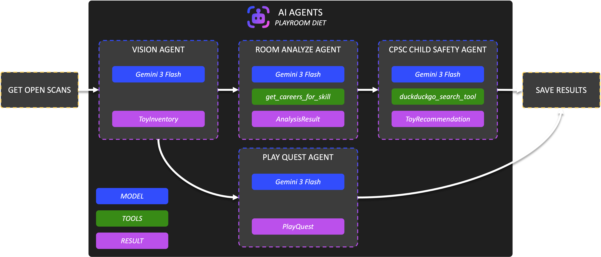

---

## Database

The database (Postgres) is using 3 main tables:

1. **`scans`**: Stores the job state, image path, and final JSON result.
2. **`occupations`**: O*NET occupation data (Imported from `Occupation Data.txt`).
3. **`abilities`**: O*NET ability scores (Imported from `Abilities.txt`).

**Source:**
- [O*NET abilities data (txt)](https://www.onetcenter.org/dl_files/database/db_30_1_text/Abilities.txt)
- [O*NET occupations data (txt)](https://www.onetcenter.org/dl_files/database/db_30_1_text/Occupation%20Data.txt)

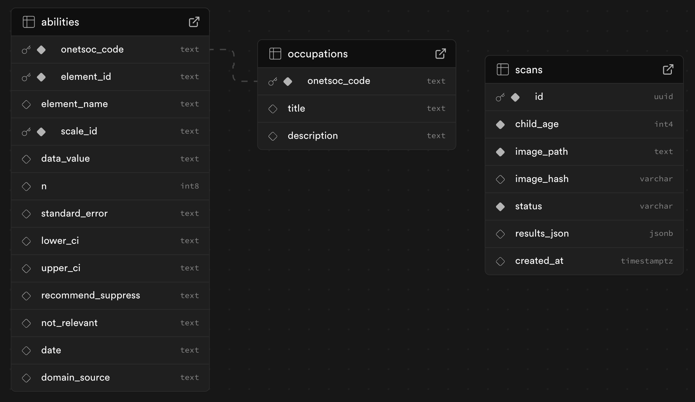

---

## Project Structure

```
gemini-playroom-diet/
├── frontend/                 # Frontend application
├── backend/                  # Backend server
├── airflow/                  # Airflow implementation
│   └── dags/
│       └── playroom_diet.py  # The multi-agent AI pipeline
├── bin/start                 # Local development startup script
├── DEPLOYMENT.md             # Notes on deployment routine
└── README.md                 # This README :)
```

---

## What I learned

I learned how to productionize multi-agent AI systems, and why using Apache Airflow is a powerful solution for this.

Using the Airflow AI SDK for multi-agent pipelines transforms the development of agentic systems from fragile Python scripts into robust, production-grade workflows. By defining agents as tasks within an Airflow Dag, you gain built-in observability. This architecture treats agents not as isolated scripts but as integrated components of a larger data ecosystem, enabling features like automatic retries, caching, and explicit dependency management between agents.

I also learned that with Gemini 3, vision and reasoning capabilities have reached a level where even critical everyday challenges, like parenting, can be supported safely and effectively.

Building Playroom Diet pushed me to think beyond single-prompt AI demos:

- **Multi-agent orchestration** with Airflow creates more robust, maintainable AI systems.
- **Structured outputs** (Pydantic + JSON mode) are essential for production AI.
- **Professional frameworks** (O*NET, CPSC) add credibility and real-world value.
- **Visual feedback** (heatmaps, detection boxes) builds user trust in AI decisions.

> Most important, I was able to solve a real problem that I, as a parent, faced every day.

---

## What's next

- **Toy donation recommendation:** Add a feature to suggest toys for donations for other kids, and directly link toy donation websites based on over-developed abilities.
- **Wish list:** Include an optional wish list where parents can list toys their kids want, allowing these preferences to be incorporated into recommendations. This can also involve suggesting variations of wishes to create a better balance of play. This could be an interesting feature for Christmas 🎄.
- **Scaling:** To keep costs near zero, all components are scaled to the minimum. A playroom scan takes a couple of minutes, mainly because the backend and Airflow infrastructure automatically scale to zero and often require a warm-up phase. Depending on how well the project is received, this can be improved by scaling the infrastructure accordingly.
- **More parenting support:** Toy management is just the beginning. Parenting is an underexplored AI use case, and many features in this area can be added.

---

> [!IMPORTANT]
> **The skills they build today become the strengths they carry forever.**

---

## Impressions

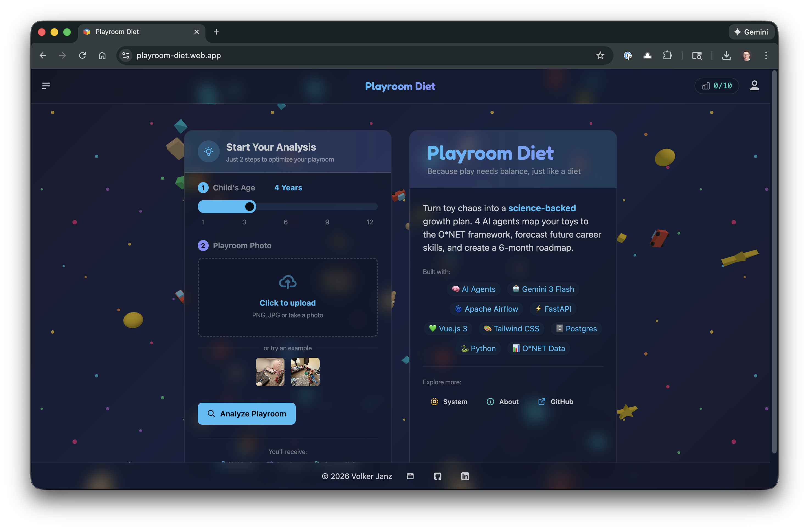

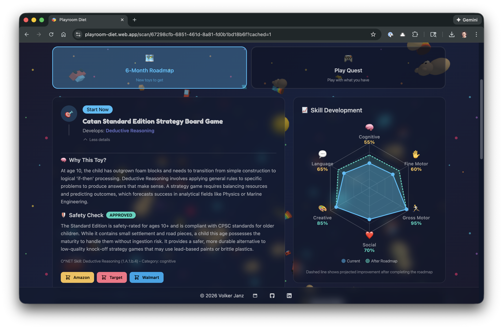

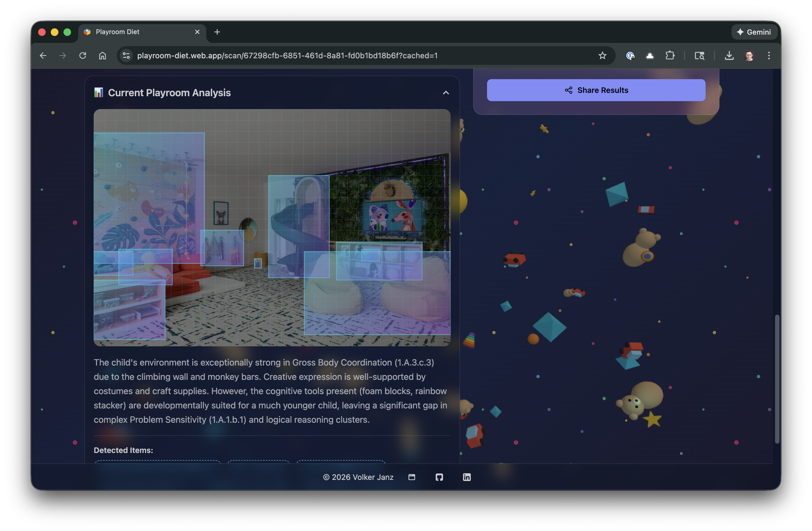

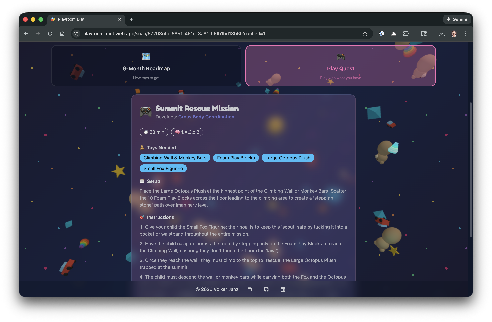
